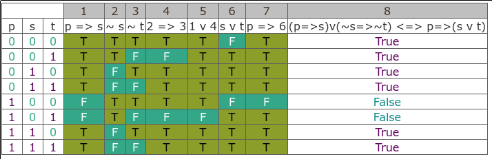
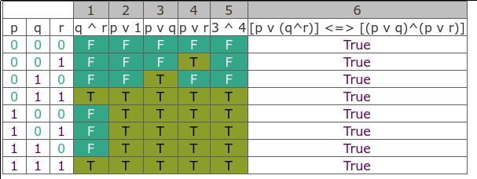

# Logic-tautologies in Ada95
My program in Ada95 for checking for tautologies and contradictions in Propositional Logic.
It checks by analysing [Truth tables](https://en.wikipedia.org/wiki/Truth_function#Table_of_binary_truth_functions)
for all possible variables values combinations.

The main logic is implemented in [tautolog.adb](tautolog.adb) Ada95 source code.

## Examples

### Example 1: `(p=>s)v(~s=>~t) <=> p=>(s v t)`

This truth table shows that `(p=>s)v(~s=>~t) <=> p=>(s v t)` statement is neither a tautology nor a contradiction.

### Example 2: `[p v (q^r)] <=> [(p v q)^(p v r)]`

This truth table shows that `[p v (q^r)] <=> [(p v q)^(p v r)]` statement is a tautology (i.e. always true for all variables values).

